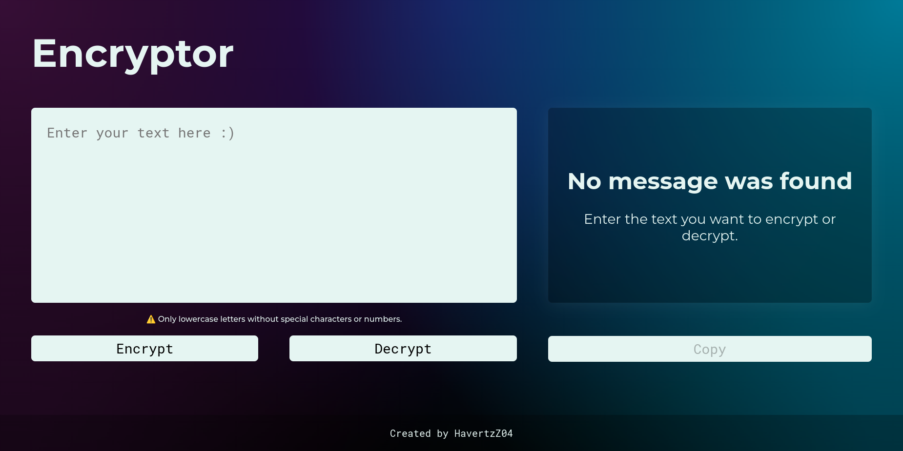

# Text Encryption Challenge

Welcome to our first challenge!

For the next four weeks, we will work on an application that encrypts texts, so you can exchange secret messages with others who know the encryption secret.

## Encryption Keys

The "keys" for encryption we will use are the following:

- The letter "e" is converted to "enter"
- The letter "i" is converted to "imes"
- The letter "a" is converted to "ai"
- The letter "o" is converted to "ober"
- The letter "u" is converted to "ufat"

## Requirements

- It must work only with lowercase letters.
- No accented letters or special characters should be used.
- It should be possible to convert a word to the encrypted version and also return an encrypted word to its original version.

### Example:
- "gato" => "gaitober"
- "gaitober" => "gato"

## Features

The page should have fields for:
- Entering the text to be encrypted or decrypted, and the user should be able to choose between the two options.
- Displaying the result on the screen.

## Extras

- A button that copies the encrypted/decrypted text to the clipboard, having the same functionality as ctrl+C or the "copy" option from the application menu.

## Usage

1. **Input the text**: Enter the text you want to encrypt or decrypt in the input field.
2. **Choose the action**: Select whether you want to encrypt or decrypt the input text.
3. **View the result**: The result will be displayed on the screen.
4. **Copy the result**: Use the copy button to copy the result to your clipboard.

Feel free to contribute to this project or report any issues you encounter.

